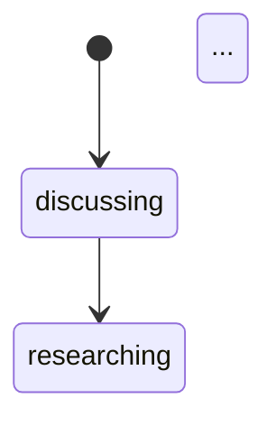

<objective>
Publish the canonical documentation layer that makes gvc0's execution flow, state shape, and coordination semantics readable without reading source. Four canonical docs + a README under `docs/foundations/`, cross-linked into `docs/README.md` and `ARCHITECTURE.md`. Mermaid diagrams for the three FSM axes, a composite validity matrix matching the implementation in `src/core/fsm/`, decision tables for coordination rules, and a single ~2k-word end-to-end narrative for newcomers.

Purpose: Phase 1's second deliverable. Addresses REQ-DOC-01/02/03 and the "opacity" pain flagged in PROJECT.md. Output: the canonical layer that later phases reference rather than re-document.

Output: a `docs/foundations/` directory with 5 markdown files, plus minimal updates to `docs/README.md` and `ARCHITECTURE.md` linking into it.
</objective>

<execution_context>
@$HOME/.claude/get-shit-done/workflows/execute-plan.md
@$HOME/.claude/get-shit-done/templates/summary.md
</execution_context>

<context>
@.planning/PROJECT.md
@.planning/ROADMAP.md
@.planning/phases/01-foundations-clarity/01-CONTEXT.md
@.planning/phases/01-foundations-clarity/01-01-SUMMARY.md
@.planning/research/ARCHITECTURE.md
@.planning/research/SUMMARY.md

@CLAUDE.md
@ARCHITECTURE.md
@docs/README.md
@docs/architecture/README.md
@docs/architecture/graph-operations.md
@docs/architecture/data-model.md
@docs/architecture/worker-model.md
@docs/architecture/planner.md
@docs/operations/README.md
@docs/operations/conflict-coordination.md
@docs/operations/verification-and-recovery.md
@docs/operations/warnings.md

@src/core/fsm/index.ts
@test/unit/core/fsm/composite-invariants.test.ts
</context>

<tasks>

<task type="auto">
  <name>Task 1: Create docs/foundations/README.md (landing page)</name>
  <files>docs/foundations/README.md</files>
  <read_first>docs/README.md, ARCHITECTURE.md, .planning/phases/01-foundations-clarity/01-CONTEXT.md</read_first>
  <action>
Create `docs/foundations/README.md` as the canonical-layer landing page. Structure:

- One-paragraph summary: "This layer answers the three questions that have historically been hardest to reason about in gvc0: (1) what state is the system in, (2) who triggers what when, (3) how do coordination rules (lock/claim/suspend/resume/rebase) actually decide what happens. Each document here is authoritative; linked `docs/architecture/*` pages remain the detail reference. When prose and a decision table disagree, the table wins."
- Links to the four sibling docs:
  - `state-axes.md` — three FSM axes + composite validity matrix
  - `execution-flow.md` — who triggers what, when, across modules
  - `coordination-rules.md` — decision tables for lock / claim / suspend / resume / rebase
  - `newcomer.md` — one end-to-end narrative (start here if this is your first look)
- A "For detail" section linking down to:
  - `../architecture/README.md`
  - `../operations/README.md`
  - `../reference/README.md`
  - `../../ARCHITECTURE.md`
- A "Relationship to source" section noting:
  - State axis types live in `src/core/state/`
  - FSM guards + composite validity in `src/core/fsm/`
  - Exhaustive matrix test in `test/unit/core/fsm/composite-invariants.test.ts`
  - Warning rules in `src/core/warnings/`
  - Graph invariants in `src/core/graph/validation.ts`

Keep the README short (<150 lines). It's a signpost, not a thesis.
  </action>
  <verify>test -f docs/foundations/README.md && wc -l docs/foundations/README.md | awk '$1 < 200'</verify>
  <acceptance_criteria>
    - "docs/foundations/README.md exists."
    - "The file contains markdown links to state-axes.md, execution-flow.md, coordination-rules.md, newcomer.md (each referenced relatively)."
    - "The file contains a link to `../../ARCHITECTURE.md`."
    - "The file length is < 200 lines."
  </acceptance_criteria>
  <done>Foundations landing page exists.</done>
</task>

<task type="auto">
  <name>Task 2: Create docs/foundations/state-axes.md (diagrams + composite matrix)</name>
  <files>docs/foundations/state-axes.md</files>
  <read_first>src/core/fsm/index.ts, src/core/state/index.ts, test/unit/core/fsm/composite-invariants.test.ts, ARCHITECTURE.md, docs/architecture/data-model.md</read_first>
  <action>
Create `docs/foundations/state-axes.md`. Sections in order:

1. **One-paragraph preamble** explaining the three axes and why state is split rather than collapsed into one enum.

2. **Work-control axis** — a Mermaid `stateDiagram-v2` block covering: `discussing → researching → planning → executing → ci_check → verifying → awaiting_merge → summarizing → work_complete`, with the `executing_repair ← verifying → ci_check` repair branch and the budget-mode short-circuit `awaiting_merge → work_complete`.

3. **Collab-control axis** — a Mermaid `stateDiagram-v2` block covering: `none → branch_open → merge_queued → integrating → merged` plus `integrating → conflict → branch_open` and the cancellation edges from `branch_open / merge_queued / conflict → cancelled`.

4. **Run-state axis (on agent_runs)** — a Mermaid `stateDiagram-v2` block covering: `ready ↔ running ↔ retry_await`, plus `running → await_response / await_approval / manual` overlays and their return paths.

5. **Composite validity matrix** — a Markdown table with columns `work | collab | run | legal? | reason-if-illegal`. Rows MUST enumerate the same (work × collab × run) combinations that `test/unit/core/fsm/composite-invariants.test.ts` exercises. Source this by reading the test's `EXPECTED_LEGAL` constant and populating the table to match. For combinations not in `EXPECTED_LEGAL`, mark `legal? = no` and give a one-line reason (e.g., "merge_queued requires work ∈ {awaiting_merge}"). Keep the table sorted by work, then collab, then run.

6. **Drift-check note** — a footer noting: "If this table disagrees with `test/unit/core/fsm/composite-invariants.test.ts`, the test wins. Phase 11 adds a CI check that enforces equality." Point the reader at both the test file path and `src/core/fsm/` for the implementation.

Each Mermaid block must be fenced as:
````

````
  </action>
  <verify>test -f docs/foundations/state-axes.md && grep -c '```mermaid' docs/foundations/state-axes.md</verify>
  <acceptance_criteria>
    - "docs/foundations/state-axes.md exists."
    - "`grep -c '```mermaid' docs/foundations/state-axes.md` is >= 3 (one per axis)."
    - "docs/foundations/state-axes.md contains the string `Composite validity matrix` (exact)."
    - "docs/foundations/state-axes.md contains the string `test/unit/core/fsm/composite-invariants.test.ts` (exact path)."
    - "The matrix section contains at least 50 table rows (loose sanity check; exhaustive is ≥420 but the matrix can omit identical 'illegal for the same reason' groupings by showing representative rows — at minimum every legal combination must appear explicitly)."
  </acceptance_criteria>
  <done>State-axes canonical doc exists with 3 Mermaid diagrams + composite matrix.</done>
</task>

<task type="auto">
  <name>Task 3: Create docs/foundations/execution-flow.md (who triggers what, when)</name>
  <files>docs/foundations/execution-flow.md</files>
  <read_first>ARCHITECTURE.md, docs/architecture/graph-operations.md, docs/architecture/worker-model.md, docs/architecture/planner.md, src/core/scheduling/, .planning/research/ARCHITECTURE.md</read_first>
  <action>
Create `docs/foundations/execution-flow.md`. The doc explains **who triggers what, when** — the execution-flow pain area called out in PROJECT.md. Structure:

1. **Event-loop overview** — a one-paragraph summary and a Mermaid `sequenceDiagram` showing the serial event queue processing: Worker→IPC→Orchestrator event→serial-queue drain→Scheduler tick→dispatch to worker / feature-phase agent.

2. **Serial event queue** — narrative explaining the four event sources (worker IPC messages, feature-phase completions, feature-phase errors, shutdown) and why all state mutations go through the queue (no locks, no CAS).

3. **Scheduler tick phases** — numbered steps exactly matching `docs/architecture/graph-operations.md §Tick Phases`: drain events → update state → check conflicts → compute frontier → sort → dispatch. For each step name the module that owns it (`core/` vs `orchestrator/`).

4. **Dispatch paths** — describes where a dispatched `SchedulableUnit` ends up:
   - `kind: "task"` → `RuntimePort.dispatchTask` → worker pool → pi-sdk `Agent` in worktree
   - `kind: "feature_phase"` → async phase-agent spawn; posts completion event back to queue
5. **Completion paths** — the inverse: worker finishes task (commit on feature branch), feature-phase finishes (advances work-control FSM), merge-train advances main.

6. **Module-boundary labels** — explicitly name each boundary the signal crosses, with a one-sentence description of what the boundary owns: TUI, App, Orchestrator, Agents, Core, Runtime, Persistence.

7. **Cross-reference footer** — link to `../architecture/graph-operations.md` (pseudocode detail), `../architecture/worker-model.md` (IPC specifics), `coordination-rules.md` (the decision tables for conflicts).

Use Mermaid for the one sequence diagram. Rest is prose + headings. Target length: 250–500 lines.
  </action>
  <verify>test -f docs/foundations/execution-flow.md && grep -c 'sequenceDiagram\|Orchestrator\|Scheduler\|Worker Pool\|pi-sdk Agent\|Worktree\|Feature Branch\|Merge Train\|main' docs/foundations/execution-flow.md</verify>
  <acceptance_criteria>
    - "docs/foundations/execution-flow.md exists."
    - "The file contains at least one ```mermaid sequenceDiagram``` block."
    - "The file names every module boundary: TUI, App, Orchestrator, Agents, Core, Runtime, Persistence (each as a heading or explicit mention)."
    - "The file contains the four event sources (`worker_message`, `feature_phase_complete`, `feature_phase_error`, `shutdown`) verbatim."
    - "The file links to `../architecture/graph-operations.md` and `../architecture/worker-model.md` and `coordination-rules.md`."
  </acceptance_criteria>
  <done>Execution-flow canonical doc exists.</done>
</task>

<task type="auto">
  <name>Task 4: Create docs/foundations/coordination-rules.md (decision tables)</name>
  <files>docs/foundations/coordination-rules.md</files>
  <read_first>docs/operations/conflict-coordination.md, docs/operations/verification-and-recovery.md, docs/operations/warnings.md, src/core/fsm/index.ts</read_first>
  <action>
Create `docs/foundations/coordination-rules.md`. The doc distills the prose in `docs/operations/conflict-coordination.md` into **decision tables**. Each family is its own section with at least one table.

Required families + minimum table content:

1. **Lock (write pre-hook path claim)** — columns: `scenario | path already locked? | same feature? | action | outcome`. Rows cover: path free → grant; path locked by same feature → wait-or-queue; path locked by different feature → route to cross-feature coordination.

2. **Claim (reservation overlap at scheduling time)** — columns: `ready unit overlaps running? | same feature? | priority tier | action`. Rows cover: no overlap → dispatch; overlap same feature → dispatch with penalty; overlap cross-feature → penalty + warning + deprioritize.

3. **Suspend (same-feature overlap runtime)** — columns: `condition | suspended task run state | worktree state | resume trigger`. Rows cover: suspend-on-lock, suspend-on-rebase-in-progress.

4. **Resume** — columns: `run_state entry | condition | resume action`. Rows cover: `retry_await` after backoff; `await_response` after inbox answered; `await_approval` after approved; `manual` after user returns ownership.

5. **Rebase (merge train head)** — columns: `merge-train state | rebase result | verify result | next state | re-entry?`. Rows cover: integrating → rebase-clean → verify-pass → merged; rebase-conflict → conflict; verify-fail → branch_open + reentry_count++.

6. **Re-entry cap** — columns: `reentry_count | action | routed to`. Rows cover: below cap → requeue at tail; at cap (configurable, default 10) → park in inbox with diagnostics.

Each family ends with a "Source of truth" subsection naming the file/function where the rule lives in code (`src/core/fsm/`, `src/core/merge-train/`, `src/core/scheduling/`, orchestrator `conflict/` module, etc.).

Top of the doc: a one-paragraph preamble noting that **tables are canonical**; `docs/operations/conflict-coordination.md` is kept as the narrative reference — if the two disagree, update the narrative.

Target length: 300–600 lines.
  </action>
  <verify>test -f docs/foundations/coordination-rules.md && grep -Ec '^## (Lock|Claim|Suspend|Resume|Rebase|Re-entry)' docs/foundations/coordination-rules.md</verify>
  <acceptance_criteria>
    - "docs/foundations/coordination-rules.md exists."
    - "The file contains headings for each of: Lock, Claim, Suspend, Resume, Rebase, Re-entry (as `## ` headings, exact match per the verify grep)."
    - "The file contains at least 6 Markdown tables (one per family minimum)."
    - "The preamble states 'tables are canonical' (exact phrase)."
  </acceptance_criteria>
  <done>Coordination-rules canonical doc exists with decision tables.</done>
</task>

<task type="auto">
  <name>Task 5: Create docs/foundations/newcomer.md (end-to-end narrative)</name>
  <files>docs/foundations/newcomer.md</files>
  <read_first>docs/foundations/state-axes.md, docs/foundations/execution-flow.md, docs/foundations/coordination-rules.md, ARCHITECTURE.md, .planning/PROJECT.md</read_first>
  <action>
Create `docs/foundations/newcomer.md` — a single narrative that takes a newcomer from "the user types a prompt" to "a commit lands on `main`". Target length: 1500–2500 words.

Structure:

- **Opening hook** — "The user types a prompt in the TUI and presses enter." Don't start with layers; start with the event.
- **Section per module boundary crossed**, in order:
  1. TUI accepts the prompt
  2. App routes to Orchestrator
  3. Top-level planner agent (pi-sdk Agent) drafts a feature DAG via graph-mutation tools
  4. Orchestrator's serial event queue applies mutations; scheduler tick computes the frontier
  5. Feature-level planner spawns for the first feature reaching `planning`; drafts a task DAG
  6. Scheduler dispatches a ready task to the worker pool (global cap, priority sort)
  7. Worker (child process) sets up a worktree branching from the feature branch
  8. pi-sdk Agent runs inside the worker; write pre-hook enforces worktree-cwd
  9. Agent produces a commit with a gvc0 trailer; worker cleans the worktree; task marked done
  10. Feature's tasks all done → verify phase (agent review) runs
  11. Verify passes → feature enters merge queue
  12. Merge train head: rebase onto latest `main` + verify → merge or eject
  13. `main` now has the feature's commits; summarizing phase runs; feature reaches `work_complete`

- **Where the inbox fits** — a short section showing how any agent along the way can `await_response` / `request_help`, routing the task to the inbox without blocking others.
- **Where the user steers** — a short section covering manual DAG edits (always-wins), additive re-plans, and the config editor menu.
- **What makes `main` safe** — one paragraph on the merge-train invariant.
- **Where to go next** — links to the other three foundations docs + `../../ARCHITECTURE.md` + `../architecture/README.md`.

Use inline links (markdown `[text](path)`) for every cross-reference — not footnotes, not numbered refs. Every module boundary mentioned in the narrative should link somewhere (to its spec, to its source dir, or to an architecture doc). Keep paragraphs short; one idea per paragraph.
  </action>
  <verify>test -f docs/foundations/newcomer.md && wc -w docs/foundations/newcomer.md | awk '$1 >= 1500 && $1 <= 2500'</verify>
  <acceptance_criteria>
    - "docs/foundations/newcomer.md exists."
    - "Word count is between 1500 and 2500 (inclusive)."
    - "The file mentions these boundaries in order: TUI, Orchestrator, Top-level planner, Scheduler, Feature-level planner, Worker, pi-sdk Agent, Worktree, Feature branch, Verify, Merge train, main."
    - "The file contains at least 10 markdown inline links (matching `[^]*]([^)]*)`; verify with `grep -oc '](' docs/foundations/newcomer.md` returning >= 10)."
  </acceptance_criteria>
  <done>Newcomer narrative lands within word budget and names every boundary in order.</done>
</task>

<task type="auto">
  <name>Task 6: Cross-link foundations from docs/README.md and ARCHITECTURE.md</name>
  <files>docs/README.md, ARCHITECTURE.md</files>
  <read_first>docs/README.md, ARCHITECTURE.md</read_first>
  <action>
Add a link to `docs/foundations/README.md` in both:

1. `docs/README.md` — add a section near the top titled **Foundations (start here)** with a single link to `./foundations/README.md` and a one-line description: "Canonical state, flow, and coordination docs — the layer newcomers should read first."

2. `ARCHITECTURE.md` — find the existing **Documentation Entry Points** section. Add an entry for `docs/foundations/README.md` at the top of the list (before `docs/README.md`) with the description: "Canonical state / flow / coordination layer (start here)."

Do NOT restructure either file. Additive only: new heading in docs/README.md; one new bullet in ARCHITECTURE.md.

After edits, sanity-check by running `grep -n 'foundations/README.md' docs/README.md ARCHITECTURE.md` and confirming at least one hit in each file.
  </action>
  <verify>grep -l 'foundations/README.md' docs/README.md ARCHITECTURE.md | wc -l | awk '$1 == 2'</verify>
  <acceptance_criteria>
    - "docs/README.md contains the string `foundations/README.md` (relative link)."
    - "ARCHITECTURE.md contains the string `docs/foundations/README.md`."
    - "Both files still build cleanly: `grep -c '^## ' docs/README.md` is unchanged or increased by exactly 1."
  </acceptance_criteria>
  <done>Foundations linked from both docs landing and ARCHITECTURE.md.</done>
</task>

<task type="auto">
  <name>Task 7: Run project check pipeline</name>
  <files></files>
  <read_first>package.json</read_first>
  <action>
Run `npm run check`. Markdown edits should not trigger any failures, but confirm Biome / tests remain green. If check fails, diagnose — most likely cause would be an accidental code-block syntax mistake that Biome's formatter treats as a broken file. Fix the docs, do not suppress the check.

Then run `npm run format:check` separately to confirm markdown formatting meets Biome's rules (if Biome formats markdown in this repo's config).
  </action>
  <verify>npm run check && npm run format:check</verify>
  <acceptance_criteria>
    - "`npm run check` exits 0."
    - "`npm run format:check` exits 0."
  </acceptance_criteria>
  <done>Full check pipeline green after docs changes.</done>
</task>

</tasks>

<verification>
Before declaring plan complete:
- [ ] `docs/foundations/` contains exactly 5 markdown files (README, state-axes, execution-flow, coordination-rules, newcomer).
- [ ] Each file passes its per-task acceptance checks (Mermaid count, word count, section headings, cross-links).
- [ ] `docs/README.md` and `ARCHITECTURE.md` both link to `docs/foundations/README.md`.
- [ ] `npm run check` exits 0.
- [ ] The composite validity matrix in `state-axes.md` matches the `EXPECTED_LEGAL` set produced by plan 01-01's test (drift check is manual for this plan; Phase 11 adds automated enforcement).
</verification>

<success_criteria>
- All tasks completed
- All verification checks pass
- A newcomer can follow the narrative in newcomer.md from prompt to merge without reading source code
- The composite validity matrix in state-axes.md matches the test's ground-truth set from plan 01-01
- Coordination rules (lock/claim/suspend/resume/rebase/re-entry) are enumerated as decision tables, each naming its source of truth in code
- Foundations layer is reachable from docs/README.md and ARCHITECTURE.md
</success_criteria>

<output>
After completion, create `.planning/phases/01-foundations-clarity/01-03-SUMMARY.md` recording: word count per doc, Mermaid block count, any intentional deviations from plan 01-01's composite matrix (e.g., if the implementation was tightened during 01-01 and the doc table had to reflect that), and any prose in `docs/operations/conflict-coordination.md` that disagrees with the new decision tables (flag for separate follow-up — do not silently update the operations doc from this plan).
</output>
