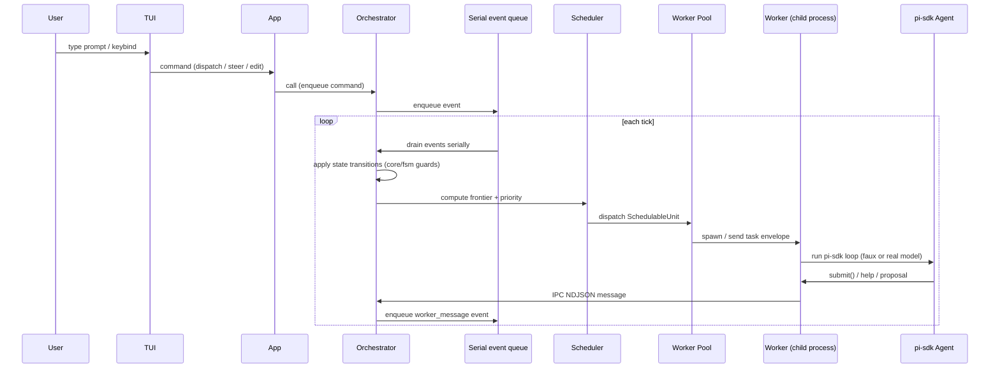

# Execution Flow

Who triggers what, when, across module boundaries. This document is the
canonical summary of the end-to-end execution model; the detail references are
[../architecture/graph-operations.md](../architecture/graph-operations.md) for
scheduler pseudocode and [../architecture/worker-model.md](../architecture/worker-model.md)
for worker/IPC mechanics.

## Event-loop overview

gvc0 runs a **hybrid serial core with async feature phases**. All
state-mutating coordination flows through a single FIFO event queue. Feature
phases (planning, verifying, summarizing, replanning) and task execution run
asynchronously in worker processes and post their results back as events. The
queue drains serially; nothing else mutates orchestrator state.

The sequence loops continuously: every worker message or feature-phase
completion pushes a new event onto the queue, which triggers the next tick.

## Serial event queue

Four event sources drive the orchestrator. All are routed through the same
queue and processed one at a time:

- **`worker_message`** — a worker child process sent an IPC NDJSON message
  (task completion, error, progress, help request, approval request, lock
  claim, assistant output). Arrives asynchronously over the stdio bridge.
- **`feature_phase_complete`** — a feature-phase agent run (planning,
  verifying, summarizing, replanning) finished and is posting its result
  (summary text, optional `VerifyIssue[]`).
- **`feature_phase_error`** — a feature-phase run failed with a typed error
  string. Handled the same as `feature_phase_complete` except the orchestrator
  routes failure through the FSM instead of advancing.
- **`shutdown`** — graceful stop signal. The scheduler drains remaining events
  and then exits.

Because the queue is serial, the orchestrator has no locks, no
compare-and-swap, and no mutex primitives. State reads and writes during a
tick see a consistent snapshot. Parallelism lives in the workers and the
phase-agents, not in orchestrator state mutation.

## Scheduler tick phases

Each tick processes the event queue and dispatches new work in six ordered
steps, matching
[../architecture/graph-operations.md § Tick Phases](../architecture/graph-operations.md#tick-phases).
The module that owns each step is marked in parentheses.

1. **Drain events** (owned by `orchestrator/`) — dequeue every pending event
   and process serially. Mutations call into `core/fsm/` guards, which are
   pure functions.
2. **Update state** (`core/` guards + `orchestrator/` callers) — apply state
   transitions. `compositeGuard` and per-axis guards in
   [`src/core/fsm/`](../../src/core/fsm/index.ts) validate legality; the
   orchestrator writes the validated state through the persistence adapter.
3. **Check conflicts** (`orchestrator/conflict` + `core/scheduling/`) — apply
   reservation-overlap penalties to ready work (tick-based). Runtime overlaps
   arrive push-style via worker write-prehooks and are handled inside the
   `worker_message` event above.
4. **Compute frontier** (`core/graph/` + `core/scheduling/`) — build the
   combined feature+task graph, run the two O(V+E) metric passes
   (`maxDepth`, `distance`), and collect ready `SchedulableUnit` values.
5. **Sort** (`core/scheduling/`) — apply the seven-key priority order
   (milestone position, work-type tier, critical path weight, partially-failed
   deprioritization, overlap penalty, retry-eligibility, age).
6. **Dispatch** (`orchestrator/` → `runtime/`) — send ready units through
   `RuntimePort.dispatchTask` or spawn a feature-phase agent. The dispatch
   returns immediately; the worker/phase agent produces an event later.

## Dispatch paths

The scheduler emits `SchedulableUnit` values of two kinds. Both share the
same worker pool and the same priority ordering, but their downstream
journeys diverge:

- **`kind: "task"`** — a concrete task in the executing feature's DAG.
  Goes through `RuntimePort.dispatchTask` → worker pool → a child process
  spawned with pi-sdk `Agent` inside an isolated git worktree branching from
  the feature branch. The worker produces NDJSON messages over stdio back to
  the orchestrator.

- **`kind: "feature_phase"`** — a feature-level agent (`plan`, `discuss`,
  `research`, `verify`, `ci_check`, `summarize`, `replan`). Dispatched
  asynchronously; the phase agent may run in-process or in a subprocess
  depending on the adapter, and posts `feature_phase_complete` /
  `feature_phase_error` back into the queue on finish. See
  [../architecture/planner.md](../architecture/planner.md) for the agent
  contracts.

The tick loop never awaits a dispatched unit inline — all completion signals
come back through the queue.

## Completion paths

Every dispatched unit eventually produces an event that advances the feature
or task through its lifecycle:

- **Task completion** — worker finishes the pi-sdk run successfully, writes a
  commit on the task worktree, and sends a `submit` message. The orchestrator
  squash-merges the task branch into the feature branch and transitions the
  task's run-state to `completed`. Task collab advances `branch_open →
  merged`.

- **Feature-phase completion** — the phase agent posts
  `feature_phase_complete`. The orchestrator advances work control: e.g.
  `planning → executing` after a successful `plan`, or `verifying →
  awaiting_merge` after a successful `verify`. `VerifyIssue[]` on a failing
  `verify` routes back to `replanning` per the data model.

- **Merge-train advance** — once a feature reaches `awaiting_merge` with
  collab `branch_open`, the merge-train executor picks it up, rebases its
  feature branch onto current `main`, re-runs `ci_check`, and (on success)
  performs `git merge --force-with-lease` into `main`. A marker row plus a
  startup reconciler handle the crash window between merge and DB transition.

- **Feature completion** — after a successful merge, the feature advances
  `awaiting_merge → summarizing` (or short-circuits to `work_complete` in
  budget mode). Summarizing posts its own `feature_phase_complete`, which
  flips work control to `work_complete`. The collab axis reaches `merged`;
  both terminals line up and the feature is fully done.

## Module-boundary labels

The execution flow crosses the following gvc0 module boundaries, each with a
narrow responsibility. The codebase maps these to TS path aliases (`@tui/*`,
`@app/*`, etc.) enforced by the boundary test from plan 01-02.

- **TUI** ([`src/tui/`](../../src/tui/)) — terminal UI shell and derived
  view-model. Translates user keybinds and prompts into orchestrator commands;
  never mutates state directly.
- **App** ([`src/app/`](../../src/app/)) — lifecycle, startup, and the
  composition root that wires orchestrator, runtime, persistence, and TUI.
- **Orchestrator** ([`src/orchestrator/`](../../src/orchestrator/)) — owns
  the serial event queue and the tick loop; coordinates feature/task
  lifecycle, conflicts, summaries. Calls into `core/` for pure decisions and
  into adapter ports for I/O.
- **Agents** ([`src/agents/`](../../src/agents/)) — planner, replanner, and
  feature-phase agent prompts and graph-mutation tools. Composed into pi-sdk
  `Agent` instances run by the runtime.
- **Core** ([`src/core/`](../../src/core/)) — pure domain: graph/state types,
  FSM guards, scheduling rules, naming utilities, warnings. Imports nothing
  from runtime/persistence/tui/orchestrator (enforced by plan 01-02's Biome
  rule and the structural boundary test).
- **Runtime** ([`src/runtime/`](../../src/runtime/)) — worker pool, IPC
  framing, harness, context assembly. Owns process spawn, stdio NDJSON
  transport, and the write-prehook lock claim round-trip.
- **Persistence** ([`src/persistence/`](../../src/persistence/)) — SQLite
  implementation with better-sqlite3. Stores the graph, run state, event log,
  and merge-train marker rows.

## Cross-reference

- [../architecture/graph-operations.md](../architecture/graph-operations.md)
  — pseudocode-level detail for the scheduler tick, combined graph, and
  priority order.
- [../architecture/worker-model.md](../architecture/worker-model.md) —
  per-task child-process model, IPC envelope shape, write-prehook claim-lock
  protocol, crash-recovery reconcilation.
- [coordination-rules.md](./coordination-rules.md) — the decision tables for
  lock / claim / suspend / resume / rebase conflicts referenced in the
  "Check conflicts" step above.
- [../architecture/planner.md](../architecture/planner.md) — feature-phase
  agent contracts for `plan`, `discuss`, `research`, `verify`, `ci_check`,
  `summarize`, `replan`.
- [../architecture/data-model.md](../architecture/data-model.md) — feature
  and task entity shapes, agent_runs columns, work/collab/run axis semantics.
