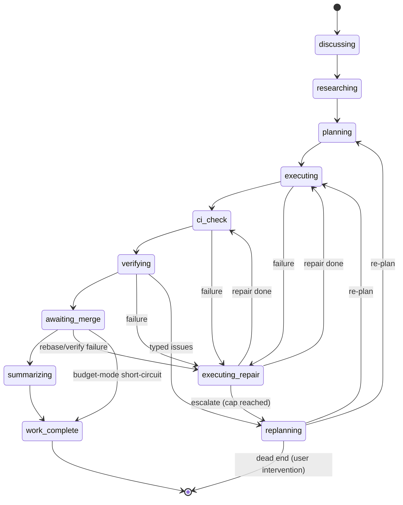
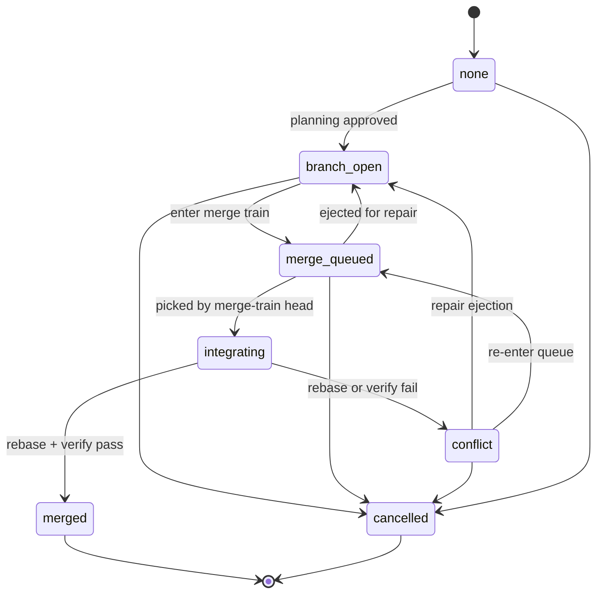
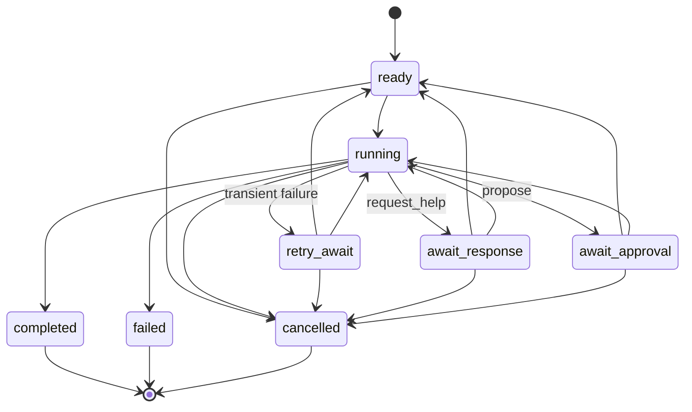

# State Axes

gvc0 splits feature state across three axes instead of collapsing them into
one enum:

- **work control** — planning and execution phase progression
- **collaboration control** — branch / merge / conflict coordination
- **run state** — the per-`agent_runs` disposition (retry windows, help /
  approval waits, terminal outcomes)

This split is deliberate. A single enum would blur orthogonal concerns: a
feature can be _executing_ (work) on a _branch_open_ collab axis with an
individual run in _retry_await_ — three independent facts that each evolve on
their own timeline. The cross-axis invariants that tie them together live in
[`compositeGuard`](../../src/core/fsm/index.ts) and are enumerated below.

For the matching transition-graph narrative and entity shapes, see
[../architecture/data-model.md](../architecture/data-model.md). This document
is the canonical summary of the three axes plus the legality matrix over their
product.

## Work-control axis

Notes:

- `replanning` is reachable only through repair escalation or verify failure.
  It is a transient repair state; the per-axis test
  [`work-control-axis.test.ts`](../../test/unit/core/fsm/work-control-axis.test.ts)
  covers its legal transitions. The cross-axis matrix below enumerates the ten
  "steady-state" work values and treats `replanning` as a transient repair
  exception — see the [replanning note](#replanning-note) below.
- The budget-mode short-circuit bypasses `summarizing` when the user runs in
  budget-first mode; see
  [../architecture/budget-and-model-routing.md](../architecture/budget-and-model-routing.md).
- Repair re-enters through `ci_check` to force re-validation after any code
  change, except that repairs originating in `executing` can return to
  `executing` directly to finish remaining work.

## Collab-control axis

Notes:

- `merged` is terminal for the happy path. `cancelled` is terminal for abort
  paths.
- `conflict` is the explicit collaboration-failure state. Ejection from
  `merge_queued` back to `branch_open` during integration repair is also
  valid (see
  [../operations/conflict-coordination.md](../operations/conflict-coordination.md)).
- Task-level collab is a separate, narrower axis (`none / branch_open /
  conflict / suspended / merged`) defined in
  [`src/core/fsm/index.ts`](../../src/core/fsm/index.ts) under
  `validateTaskCollabTransition`.

## Run-state axis

Notes:

- The run-state axis is the type exported as
  [`AgentRunStatus`](../../src/core/types/index.ts) and aliased as `RunState`
  in [`src/core/fsm/index.ts`](../../src/core/fsm/index.ts). It lives on
  `agent_runs` rows and is independent of feature work/collab.
- `manual` is **not** a run-state value. Manual user ownership is tracked
  separately via `RunOwner` on the same row, so run-state stays focused on
  agent disposition.
- `await_response` and `await_approval` are overlays on an otherwise active
  run — they transition back through `ready` or `running` once the inbox is
  resolved.

## Composite validity matrix

The matrix below enumerates every (work × collab × run) combination the
executable guard in
[`src/core/fsm/index.ts`](../../src/core/fsm/index.ts) `compositeGuard`
checks. The axis domains are:

- **work**: the ten steady-state values `discussing, researching, planning,
  executing, executing_repair, ci_check, verifying, awaiting_merge,
  summarizing, work_complete` (excluding transient `replanning`, see note
  below).
- **collab**: the seven values `none, branch_open, merge_queued, integrating,
  merged, conflict, cancelled`.
- **run**: the six non-terminal / terminal-success values `ready, running,
  retry_await, await_response, await_approval, completed`.

10 × 7 × 6 = 420 combinations. 186 are legal; 234 are rejected.

The row order is `work` (outer) → `collab` → `run` (inner), matching the
iteration order of the exhaustive test in
[`test/unit/core/fsm/composite-invariants.test.ts`](../../test/unit/core/fsm/composite-invariants.test.ts).

### Composite validity matrix

<!-- BEGIN MATRIX -->
| work | collab | run | legal? | reason-if-illegal |
| ---- | ------ | --- | ------ | ----------------- |
| discussing | none | ready | yes |  |
| discussing | none | running | yes |  |
| discussing | none | retry_await | yes |  |
| discussing | none | await_response | yes |  |
| discussing | none | await_approval | yes |  |
| discussing | none | completed | yes |  |
| discussing | branch_open | ready | no | Rule 7: pre-branch phase requires collab=none\|cancelled |
| discussing | branch_open | running | no | Rule 7: pre-branch phase requires collab=none\|cancelled |
| discussing | branch_open | retry_await | no | Rule 7: pre-branch phase requires collab=none\|cancelled |
| discussing | branch_open | await_response | no | Rule 7: pre-branch phase requires collab=none\|cancelled |
| discussing | branch_open | await_approval | no | Rule 7: pre-branch phase requires collab=none\|cancelled |
| discussing | branch_open | completed | no | Rule 7: pre-branch phase requires collab=none\|cancelled |
| discussing | merge_queued | ready | no | Rule 7: pre-branch phase requires collab=none\|cancelled |
| discussing | merge_queued | running | no | Rule 7: pre-branch phase requires collab=none\|cancelled |
| discussing | merge_queued | retry_await | no | Rule 7: pre-branch phase requires collab=none\|cancelled |
| discussing | merge_queued | await_response | no | Rule 5: merge_queued forbids run=await_response |
| discussing | merge_queued | await_approval | no | Rule 6: merge_queued forbids run=await_approval |
| discussing | merge_queued | completed | no | Rule 7: pre-branch phase requires collab=none\|cancelled |
| discussing | integrating | ready | no | Rule 7: pre-branch phase requires collab=none\|cancelled |
| discussing | integrating | running | no | Rule 7: pre-branch phase requires collab=none\|cancelled |
| discussing | integrating | retry_await | no | Rule 7: pre-branch phase requires collab=none\|cancelled |
| discussing | integrating | await_response | no | Rule 7: pre-branch phase requires collab=none\|cancelled |
| discussing | integrating | await_approval | no | Rule 7: pre-branch phase requires collab=none\|cancelled |
| discussing | integrating | completed | no | Rule 7: pre-branch phase requires collab=none\|cancelled |
| discussing | merged | ready | no | Rule 7: pre-branch phase requires collab=none\|cancelled |
| discussing | merged | running | no | Rule 7: pre-branch phase requires collab=none\|cancelled |
| discussing | merged | retry_await | no | Rule 7: pre-branch phase requires collab=none\|cancelled |
| discussing | merged | await_response | no | Rule 7: pre-branch phase requires collab=none\|cancelled |
| discussing | merged | await_approval | no | Rule 7: pre-branch phase requires collab=none\|cancelled |
| discussing | merged | completed | no | Rule 7: pre-branch phase requires collab=none\|cancelled |
| discussing | conflict | ready | no | Rule 7: pre-branch phase requires collab=none\|cancelled |
| discussing | conflict | running | no | Rule 7: pre-branch phase requires collab=none\|cancelled |
| discussing | conflict | retry_await | no | Rule 7: pre-branch phase requires collab=none\|cancelled |
| discussing | conflict | await_response | no | Rule 7: pre-branch phase requires collab=none\|cancelled |
| discussing | conflict | await_approval | no | Rule 7: pre-branch phase requires collab=none\|cancelled |
| discussing | conflict | completed | no | Rule 7: pre-branch phase requires collab=none\|cancelled |
| discussing | cancelled | ready | yes |  |
| discussing | cancelled | running | yes |  |
| discussing | cancelled | retry_await | yes |  |
| discussing | cancelled | await_response | no | Rule 8: wait run-state requires active work |
| discussing | cancelled | await_approval | no | Rule 8: wait run-state requires active work |
| discussing | cancelled | completed | yes |  |
| researching | none | ready | yes |  |
| researching | none | running | yes |  |
| researching | none | retry_await | yes |  |
| researching | none | await_response | yes |  |
| researching | none | await_approval | yes |  |
| researching | none | completed | yes |  |
| researching | branch_open | ready | no | Rule 7: pre-branch phase requires collab=none\|cancelled |
| researching | branch_open | running | no | Rule 7: pre-branch phase requires collab=none\|cancelled |
| researching | branch_open | retry_await | no | Rule 7: pre-branch phase requires collab=none\|cancelled |
| researching | branch_open | await_response | no | Rule 7: pre-branch phase requires collab=none\|cancelled |
| researching | branch_open | await_approval | no | Rule 7: pre-branch phase requires collab=none\|cancelled |
| researching | branch_open | completed | no | Rule 7: pre-branch phase requires collab=none\|cancelled |
| researching | merge_queued | ready | no | Rule 7: pre-branch phase requires collab=none\|cancelled |
| researching | merge_queued | running | no | Rule 7: pre-branch phase requires collab=none\|cancelled |
| researching | merge_queued | retry_await | no | Rule 7: pre-branch phase requires collab=none\|cancelled |
| researching | merge_queued | await_response | no | Rule 5: merge_queued forbids run=await_response |
| researching | merge_queued | await_approval | no | Rule 6: merge_queued forbids run=await_approval |
| researching | merge_queued | completed | no | Rule 7: pre-branch phase requires collab=none\|cancelled |
| researching | integrating | ready | no | Rule 7: pre-branch phase requires collab=none\|cancelled |
| researching | integrating | running | no | Rule 7: pre-branch phase requires collab=none\|cancelled |
| researching | integrating | retry_await | no | Rule 7: pre-branch phase requires collab=none\|cancelled |
| researching | integrating | await_response | no | Rule 7: pre-branch phase requires collab=none\|cancelled |
| researching | integrating | await_approval | no | Rule 7: pre-branch phase requires collab=none\|cancelled |
| researching | integrating | completed | no | Rule 7: pre-branch phase requires collab=none\|cancelled |
| researching | merged | ready | no | Rule 7: pre-branch phase requires collab=none\|cancelled |
| researching | merged | running | no | Rule 7: pre-branch phase requires collab=none\|cancelled |
| researching | merged | retry_await | no | Rule 7: pre-branch phase requires collab=none\|cancelled |
| researching | merged | await_response | no | Rule 7: pre-branch phase requires collab=none\|cancelled |
| researching | merged | await_approval | no | Rule 7: pre-branch phase requires collab=none\|cancelled |
| researching | merged | completed | no | Rule 7: pre-branch phase requires collab=none\|cancelled |
| researching | conflict | ready | no | Rule 7: pre-branch phase requires collab=none\|cancelled |
| researching | conflict | running | no | Rule 7: pre-branch phase requires collab=none\|cancelled |
| researching | conflict | retry_await | no | Rule 7: pre-branch phase requires collab=none\|cancelled |
| researching | conflict | await_response | no | Rule 7: pre-branch phase requires collab=none\|cancelled |
| researching | conflict | await_approval | no | Rule 7: pre-branch phase requires collab=none\|cancelled |
| researching | conflict | completed | no | Rule 7: pre-branch phase requires collab=none\|cancelled |
| researching | cancelled | ready | yes |  |
| researching | cancelled | running | yes |  |
| researching | cancelled | retry_await | yes |  |
| researching | cancelled | await_response | no | Rule 8: wait run-state requires active work |
| researching | cancelled | await_approval | no | Rule 8: wait run-state requires active work |
| researching | cancelled | completed | yes |  |
| planning | none | ready | yes |  |
| planning | none | running | yes |  |
| planning | none | retry_await | yes |  |
| planning | none | await_response | yes |  |
| planning | none | await_approval | yes |  |
| planning | none | completed | yes |  |
| planning | branch_open | ready | no | Rule 7: pre-branch phase requires collab=none\|cancelled |
| planning | branch_open | running | no | Rule 7: pre-branch phase requires collab=none\|cancelled |
| planning | branch_open | retry_await | no | Rule 7: pre-branch phase requires collab=none\|cancelled |
| planning | branch_open | await_response | no | Rule 7: pre-branch phase requires collab=none\|cancelled |
| planning | branch_open | await_approval | no | Rule 7: pre-branch phase requires collab=none\|cancelled |
| planning | branch_open | completed | no | Rule 7: pre-branch phase requires collab=none\|cancelled |
| planning | merge_queued | ready | no | Rule 7: pre-branch phase requires collab=none\|cancelled |
| planning | merge_queued | running | no | Rule 7: pre-branch phase requires collab=none\|cancelled |
| planning | merge_queued | retry_await | no | Rule 7: pre-branch phase requires collab=none\|cancelled |
| planning | merge_queued | await_response | no | Rule 5: merge_queued forbids run=await_response |
| planning | merge_queued | await_approval | no | Rule 6: merge_queued forbids run=await_approval |
| planning | merge_queued | completed | no | Rule 7: pre-branch phase requires collab=none\|cancelled |
| planning | integrating | ready | no | Rule 7: pre-branch phase requires collab=none\|cancelled |
| planning | integrating | running | no | Rule 7: pre-branch phase requires collab=none\|cancelled |
| planning | integrating | retry_await | no | Rule 7: pre-branch phase requires collab=none\|cancelled |
| planning | integrating | await_response | no | Rule 7: pre-branch phase requires collab=none\|cancelled |
| planning | integrating | await_approval | no | Rule 7: pre-branch phase requires collab=none\|cancelled |
| planning | integrating | completed | no | Rule 7: pre-branch phase requires collab=none\|cancelled |
| planning | merged | ready | no | Rule 7: pre-branch phase requires collab=none\|cancelled |
| planning | merged | running | no | Rule 7: pre-branch phase requires collab=none\|cancelled |
| planning | merged | retry_await | no | Rule 7: pre-branch phase requires collab=none\|cancelled |
| planning | merged | await_response | no | Rule 7: pre-branch phase requires collab=none\|cancelled |
| planning | merged | await_approval | no | Rule 7: pre-branch phase requires collab=none\|cancelled |
| planning | merged | completed | no | Rule 7: pre-branch phase requires collab=none\|cancelled |
| planning | conflict | ready | no | Rule 7: pre-branch phase requires collab=none\|cancelled |
| planning | conflict | running | no | Rule 7: pre-branch phase requires collab=none\|cancelled |
| planning | conflict | retry_await | no | Rule 7: pre-branch phase requires collab=none\|cancelled |
| planning | conflict | await_response | no | Rule 7: pre-branch phase requires collab=none\|cancelled |
| planning | conflict | await_approval | no | Rule 7: pre-branch phase requires collab=none\|cancelled |
| planning | conflict | completed | no | Rule 7: pre-branch phase requires collab=none\|cancelled |
| planning | cancelled | ready | yes |  |
| planning | cancelled | running | yes |  |
| planning | cancelled | retry_await | yes |  |
| planning | cancelled | await_response | no | Rule 8: wait run-state requires active work |
| planning | cancelled | await_approval | no | Rule 8: wait run-state requires active work |
| planning | cancelled | completed | yes |  |
| executing | none | ready | no | Rule 3: active phase requires a branch (collab != none) |
| executing | none | running | no | Rule 3: active phase requires a branch (collab != none) |
| executing | none | retry_await | no | Rule 3: active phase requires a branch (collab != none) |
| executing | none | await_response | no | Rule 3: active phase requires a branch (collab != none) |
| executing | none | await_approval | no | Rule 3: active phase requires a branch (collab != none) |
| executing | none | completed | no | Rule 3: active phase requires a branch (collab != none) |
| executing | branch_open | ready | yes |  |
| executing | branch_open | running | yes |  |
| executing | branch_open | retry_await | yes |  |
| executing | branch_open | await_response | yes |  |
| executing | branch_open | await_approval | yes |  |
| executing | branch_open | completed | yes |  |
| executing | merge_queued | ready | yes |  |
| executing | merge_queued | running | yes |  |
| executing | merge_queued | retry_await | yes |  |
| executing | merge_queued | await_response | no | Rule 5: merge_queued forbids run=await_response |
| executing | merge_queued | await_approval | no | Rule 6: merge_queued forbids run=await_approval |
| executing | merge_queued | completed | yes |  |
| executing | integrating | ready | yes |  |
| executing | integrating | running | yes |  |
| executing | integrating | retry_await | yes |  |
| executing | integrating | await_response | yes |  |
| executing | integrating | await_approval | yes |  |
| executing | integrating | completed | yes |  |
| executing | merged | ready | yes |  |
| executing | merged | running | yes |  |
| executing | merged | retry_await | yes |  |
| executing | merged | await_response | no | Rule 8: wait run-state requires active work |
| executing | merged | await_approval | no | Rule 8: wait run-state requires active work |
| executing | merged | completed | yes |  |
| executing | conflict | ready | yes |  |
| executing | conflict | running | yes |  |
| executing | conflict | retry_await | yes |  |
| executing | conflict | await_response | yes |  |
| executing | conflict | await_approval | yes |  |
| executing | conflict | completed | yes |  |
| executing | cancelled | ready | no | Rule 4: cancelled collab freezes active work |
| executing | cancelled | running | no | Rule 4: cancelled collab freezes active work |
| executing | cancelled | retry_await | no | Rule 4: cancelled collab freezes active work |
| executing | cancelled | await_response | no | Rule 4: cancelled collab freezes active work |
| executing | cancelled | await_approval | no | Rule 4: cancelled collab freezes active work |
| executing | cancelled | completed | no | Rule 4: cancelled collab freezes active work |
| executing_repair | none | ready | no | Rule 3: active phase requires a branch (collab != none) |
| executing_repair | none | running | no | Rule 3: active phase requires a branch (collab != none) |
| executing_repair | none | retry_await | no | Rule 3: active phase requires a branch (collab != none) |
| executing_repair | none | await_response | no | Rule 3: active phase requires a branch (collab != none) |
| executing_repair | none | await_approval | no | Rule 3: active phase requires a branch (collab != none) |
| executing_repair | none | completed | no | Rule 3: active phase requires a branch (collab != none) |
| executing_repair | branch_open | ready | yes |  |
| executing_repair | branch_open | running | yes |  |
| executing_repair | branch_open | retry_await | yes |  |
| executing_repair | branch_open | await_response | yes |  |
| executing_repair | branch_open | await_approval | yes |  |
| executing_repair | branch_open | completed | yes |  |
| executing_repair | merge_queued | ready | yes |  |
| executing_repair | merge_queued | running | yes |  |
| executing_repair | merge_queued | retry_await | yes |  |
| executing_repair | merge_queued | await_response | no | Rule 5: merge_queued forbids run=await_response |
| executing_repair | merge_queued | await_approval | no | Rule 6: merge_queued forbids run=await_approval |
| executing_repair | merge_queued | completed | yes |  |
| executing_repair | integrating | ready | yes |  |
| executing_repair | integrating | running | yes |  |
| executing_repair | integrating | retry_await | yes |  |
| executing_repair | integrating | await_response | yes |  |
| executing_repair | integrating | await_approval | yes |  |
| executing_repair | integrating | completed | yes |  |
| executing_repair | merged | ready | yes |  |
| executing_repair | merged | running | yes |  |
| executing_repair | merged | retry_await | yes |  |
| executing_repair | merged | await_response | no | Rule 8: wait run-state requires active work |
| executing_repair | merged | await_approval | no | Rule 8: wait run-state requires active work |
| executing_repair | merged | completed | yes |  |
| executing_repair | conflict | ready | yes |  |
| executing_repair | conflict | running | yes |  |
| executing_repair | conflict | retry_await | yes |  |
| executing_repair | conflict | await_response | yes |  |
| executing_repair | conflict | await_approval | yes |  |
| executing_repair | conflict | completed | yes |  |
| executing_repair | cancelled | ready | no | Rule 4: cancelled collab freezes active work |
| executing_repair | cancelled | running | no | Rule 4: cancelled collab freezes active work |
| executing_repair | cancelled | retry_await | no | Rule 4: cancelled collab freezes active work |
| executing_repair | cancelled | await_response | no | Rule 4: cancelled collab freezes active work |
| executing_repair | cancelled | await_approval | no | Rule 4: cancelled collab freezes active work |
| executing_repair | cancelled | completed | no | Rule 4: cancelled collab freezes active work |
| ci_check | none | ready | no | Rule 3: active phase requires a branch (collab != none) |
| ci_check | none | running | no | Rule 3: active phase requires a branch (collab != none) |
| ci_check | none | retry_await | no | Rule 3: active phase requires a branch (collab != none) |
| ci_check | none | await_response | no | Rule 3: active phase requires a branch (collab != none) |
| ci_check | none | await_approval | no | Rule 3: active phase requires a branch (collab != none) |
| ci_check | none | completed | no | Rule 3: active phase requires a branch (collab != none) |
| ci_check | branch_open | ready | yes |  |
| ci_check | branch_open | running | yes |  |
| ci_check | branch_open | retry_await | yes |  |
| ci_check | branch_open | await_response | yes |  |
| ci_check | branch_open | await_approval | yes |  |
| ci_check | branch_open | completed | yes |  |
| ci_check | merge_queued | ready | yes |  |
| ci_check | merge_queued | running | yes |  |
| ci_check | merge_queued | retry_await | yes |  |
| ci_check | merge_queued | await_response | no | Rule 5: merge_queued forbids run=await_response |
| ci_check | merge_queued | await_approval | no | Rule 6: merge_queued forbids run=await_approval |
| ci_check | merge_queued | completed | yes |  |
| ci_check | integrating | ready | yes |  |
| ci_check | integrating | running | yes |  |
| ci_check | integrating | retry_await | yes |  |
| ci_check | integrating | await_response | yes |  |
| ci_check | integrating | await_approval | yes |  |
| ci_check | integrating | completed | yes |  |
| ci_check | merged | ready | yes |  |
| ci_check | merged | running | yes |  |
| ci_check | merged | retry_await | yes |  |
| ci_check | merged | await_response | no | Rule 8: wait run-state requires active work |
| ci_check | merged | await_approval | no | Rule 8: wait run-state requires active work |
| ci_check | merged | completed | yes |  |
| ci_check | conflict | ready | yes |  |
| ci_check | conflict | running | yes |  |
| ci_check | conflict | retry_await | yes |  |
| ci_check | conflict | await_response | yes |  |
| ci_check | conflict | await_approval | yes |  |
| ci_check | conflict | completed | yes |  |
| ci_check | cancelled | ready | no | Rule 4: cancelled collab freezes active work |
| ci_check | cancelled | running | no | Rule 4: cancelled collab freezes active work |
| ci_check | cancelled | retry_await | no | Rule 4: cancelled collab freezes active work |
| ci_check | cancelled | await_response | no | Rule 4: cancelled collab freezes active work |
| ci_check | cancelled | await_approval | no | Rule 4: cancelled collab freezes active work |
| ci_check | cancelled | completed | no | Rule 4: cancelled collab freezes active work |
| verifying | none | ready | no | Rule 3: active phase requires a branch (collab != none) |
| verifying | none | running | no | Rule 3: active phase requires a branch (collab != none) |
| verifying | none | retry_await | no | Rule 3: active phase requires a branch (collab != none) |
| verifying | none | await_response | no | Rule 3: active phase requires a branch (collab != none) |
| verifying | none | await_approval | no | Rule 3: active phase requires a branch (collab != none) |
| verifying | none | completed | no | Rule 3: active phase requires a branch (collab != none) |
| verifying | branch_open | ready | yes |  |
| verifying | branch_open | running | yes |  |
| verifying | branch_open | retry_await | yes |  |
| verifying | branch_open | await_response | yes |  |
| verifying | branch_open | await_approval | yes |  |
| verifying | branch_open | completed | yes |  |
| verifying | merge_queued | ready | yes |  |
| verifying | merge_queued | running | yes |  |
| verifying | merge_queued | retry_await | yes |  |
| verifying | merge_queued | await_response | no | Rule 5: merge_queued forbids run=await_response |
| verifying | merge_queued | await_approval | no | Rule 6: merge_queued forbids run=await_approval |
| verifying | merge_queued | completed | yes |  |
| verifying | integrating | ready | yes |  |
| verifying | integrating | running | yes |  |
| verifying | integrating | retry_await | yes |  |
| verifying | integrating | await_response | yes |  |
| verifying | integrating | await_approval | yes |  |
| verifying | integrating | completed | yes |  |
| verifying | merged | ready | yes |  |
| verifying | merged | running | yes |  |
| verifying | merged | retry_await | yes |  |
| verifying | merged | await_response | no | Rule 8: wait run-state requires active work |
| verifying | merged | await_approval | no | Rule 8: wait run-state requires active work |
| verifying | merged | completed | yes |  |
| verifying | conflict | ready | yes |  |
| verifying | conflict | running | yes |  |
| verifying | conflict | retry_await | yes |  |
| verifying | conflict | await_response | yes |  |
| verifying | conflict | await_approval | yes |  |
| verifying | conflict | completed | yes |  |
| verifying | cancelled | ready | no | Rule 4: cancelled collab freezes active work |
| verifying | cancelled | running | no | Rule 4: cancelled collab freezes active work |
| verifying | cancelled | retry_await | no | Rule 4: cancelled collab freezes active work |
| verifying | cancelled | await_response | no | Rule 4: cancelled collab freezes active work |
| verifying | cancelled | await_approval | no | Rule 4: cancelled collab freezes active work |
| verifying | cancelled | completed | no | Rule 4: cancelled collab freezes active work |
| awaiting_merge | none | ready | no | Rule 2: awaiting_merge needs branch_open\|merge_queued\|integrating\|conflict |
| awaiting_merge | none | running | no | Rule 2: awaiting_merge needs branch_open\|merge_queued\|integrating\|conflict |
| awaiting_merge | none | retry_await | no | Rule 2: awaiting_merge needs branch_open\|merge_queued\|integrating\|conflict |
| awaiting_merge | none | await_response | no | Rule 2: awaiting_merge needs branch_open\|merge_queued\|integrating\|conflict |
| awaiting_merge | none | await_approval | no | Rule 2: awaiting_merge needs branch_open\|merge_queued\|integrating\|conflict |
| awaiting_merge | none | completed | no | Rule 2: awaiting_merge needs branch_open\|merge_queued\|integrating\|conflict |
| awaiting_merge | branch_open | ready | yes |  |
| awaiting_merge | branch_open | running | yes |  |
| awaiting_merge | branch_open | retry_await | yes |  |
| awaiting_merge | branch_open | await_response | yes |  |
| awaiting_merge | branch_open | await_approval | yes |  |
| awaiting_merge | branch_open | completed | yes |  |
| awaiting_merge | merge_queued | ready | yes |  |
| awaiting_merge | merge_queued | running | yes |  |
| awaiting_merge | merge_queued | retry_await | yes |  |
| awaiting_merge | merge_queued | await_response | no | Rule 5: merge_queued forbids run=await_response |
| awaiting_merge | merge_queued | await_approval | no | Rule 6: merge_queued forbids run=await_approval |
| awaiting_merge | merge_queued | completed | yes |  |
| awaiting_merge | integrating | ready | yes |  |
| awaiting_merge | integrating | running | yes |  |
| awaiting_merge | integrating | retry_await | yes |  |
| awaiting_merge | integrating | await_response | yes |  |
| awaiting_merge | integrating | await_approval | yes |  |
| awaiting_merge | integrating | completed | yes |  |
| awaiting_merge | merged | ready | no | Rule 2: awaiting_merge needs branch_open\|merge_queued\|integrating\|conflict |
| awaiting_merge | merged | running | no | Rule 2: awaiting_merge needs branch_open\|merge_queued\|integrating\|conflict |
| awaiting_merge | merged | retry_await | no | Rule 2: awaiting_merge needs branch_open\|merge_queued\|integrating\|conflict |
| awaiting_merge | merged | await_response | no | Rule 2: awaiting_merge needs branch_open\|merge_queued\|integrating\|conflict |
| awaiting_merge | merged | await_approval | no | Rule 2: awaiting_merge needs branch_open\|merge_queued\|integrating\|conflict |
| awaiting_merge | merged | completed | no | Rule 2: awaiting_merge needs branch_open\|merge_queued\|integrating\|conflict |
| awaiting_merge | conflict | ready | yes |  |
| awaiting_merge | conflict | running | yes |  |
| awaiting_merge | conflict | retry_await | yes |  |
| awaiting_merge | conflict | await_response | yes |  |
| awaiting_merge | conflict | await_approval | yes |  |
| awaiting_merge | conflict | completed | yes |  |
| awaiting_merge | cancelled | ready | no | Rule 2: awaiting_merge needs branch_open\|merge_queued\|integrating\|conflict |
| awaiting_merge | cancelled | running | no | Rule 2: awaiting_merge needs branch_open\|merge_queued\|integrating\|conflict |
| awaiting_merge | cancelled | retry_await | no | Rule 2: awaiting_merge needs branch_open\|merge_queued\|integrating\|conflict |
| awaiting_merge | cancelled | await_response | no | Rule 2: awaiting_merge needs branch_open\|merge_queued\|integrating\|conflict |
| awaiting_merge | cancelled | await_approval | no | Rule 2: awaiting_merge needs branch_open\|merge_queued\|integrating\|conflict |
| awaiting_merge | cancelled | completed | no | Rule 2: awaiting_merge needs branch_open\|merge_queued\|integrating\|conflict |
| summarizing | none | ready | no | Rule 3: active phase requires a branch (collab != none) |
| summarizing | none | running | no | Rule 3: active phase requires a branch (collab != none) |
| summarizing | none | retry_await | no | Rule 3: active phase requires a branch (collab != none) |
| summarizing | none | await_response | no | Rule 3: active phase requires a branch (collab != none) |
| summarizing | none | await_approval | no | Rule 3: active phase requires a branch (collab != none) |
| summarizing | none | completed | no | Rule 3: active phase requires a branch (collab != none) |
| summarizing | branch_open | ready | yes |  |
| summarizing | branch_open | running | yes |  |
| summarizing | branch_open | retry_await | yes |  |
| summarizing | branch_open | await_response | yes |  |
| summarizing | branch_open | await_approval | yes |  |
| summarizing | branch_open | completed | yes |  |
| summarizing | merge_queued | ready | yes |  |
| summarizing | merge_queued | running | yes |  |
| summarizing | merge_queued | retry_await | yes |  |
| summarizing | merge_queued | await_response | no | Rule 5: merge_queued forbids run=await_response |
| summarizing | merge_queued | await_approval | no | Rule 6: merge_queued forbids run=await_approval |
| summarizing | merge_queued | completed | yes |  |
| summarizing | integrating | ready | yes |  |
| summarizing | integrating | running | yes |  |
| summarizing | integrating | retry_await | yes |  |
| summarizing | integrating | await_response | yes |  |
| summarizing | integrating | await_approval | yes |  |
| summarizing | integrating | completed | yes |  |
| summarizing | merged | ready | yes |  |
| summarizing | merged | running | yes |  |
| summarizing | merged | retry_await | yes |  |
| summarizing | merged | await_response | no | Rule 8: wait run-state requires active work |
| summarizing | merged | await_approval | no | Rule 8: wait run-state requires active work |
| summarizing | merged | completed | yes |  |
| summarizing | conflict | ready | yes |  |
| summarizing | conflict | running | yes |  |
| summarizing | conflict | retry_await | yes |  |
| summarizing | conflict | await_response | yes |  |
| summarizing | conflict | await_approval | yes |  |
| summarizing | conflict | completed | yes |  |
| summarizing | cancelled | ready | no | Rule 4: cancelled collab freezes active work |
| summarizing | cancelled | running | no | Rule 4: cancelled collab freezes active work |
| summarizing | cancelled | retry_await | no | Rule 4: cancelled collab freezes active work |
| summarizing | cancelled | await_response | no | Rule 4: cancelled collab freezes active work |
| summarizing | cancelled | await_approval | no | Rule 4: cancelled collab freezes active work |
| summarizing | cancelled | completed | no | Rule 4: cancelled collab freezes active work |
| work_complete | none | ready | no | Rule 1: work_complete requires collab=merged |
| work_complete | none | running | no | Rule 1: work_complete requires collab=merged |
| work_complete | none | retry_await | no | Rule 1: work_complete requires collab=merged |
| work_complete | none | await_response | no | Rule 1: work_complete requires collab=merged |
| work_complete | none | await_approval | no | Rule 1: work_complete requires collab=merged |
| work_complete | none | completed | no | Rule 1: work_complete requires collab=merged |
| work_complete | branch_open | ready | no | Rule 1: work_complete requires collab=merged |
| work_complete | branch_open | running | no | Rule 1: work_complete requires collab=merged |
| work_complete | branch_open | retry_await | no | Rule 1: work_complete requires collab=merged |
| work_complete | branch_open | await_response | no | Rule 1: work_complete requires collab=merged |
| work_complete | branch_open | await_approval | no | Rule 1: work_complete requires collab=merged |
| work_complete | branch_open | completed | no | Rule 1: work_complete requires collab=merged |
| work_complete | merge_queued | ready | no | Rule 1: work_complete requires collab=merged |
| work_complete | merge_queued | running | no | Rule 1: work_complete requires collab=merged |
| work_complete | merge_queued | retry_await | no | Rule 1: work_complete requires collab=merged |
| work_complete | merge_queued | await_response | no | Rule 1: work_complete requires collab=merged |
| work_complete | merge_queued | await_approval | no | Rule 1: work_complete requires collab=merged |
| work_complete | merge_queued | completed | no | Rule 1: work_complete requires collab=merged |
| work_complete | integrating | ready | no | Rule 1: work_complete requires collab=merged |
| work_complete | integrating | running | no | Rule 1: work_complete requires collab=merged |
| work_complete | integrating | retry_await | no | Rule 1: work_complete requires collab=merged |
| work_complete | integrating | await_response | no | Rule 1: work_complete requires collab=merged |
| work_complete | integrating | await_approval | no | Rule 1: work_complete requires collab=merged |
| work_complete | integrating | completed | no | Rule 1: work_complete requires collab=merged |
| work_complete | merged | ready | yes |  |
| work_complete | merged | running | yes |  |
| work_complete | merged | retry_await | yes |  |
| work_complete | merged | await_response | no | Rule 8: wait run-state requires active work |
| work_complete | merged | await_approval | no | Rule 8: wait run-state requires active work |
| work_complete | merged | completed | yes |  |
| work_complete | conflict | ready | no | Rule 1: work_complete requires collab=merged |
| work_complete | conflict | running | no | Rule 1: work_complete requires collab=merged |
| work_complete | conflict | retry_await | no | Rule 1: work_complete requires collab=merged |
| work_complete | conflict | await_response | no | Rule 1: work_complete requires collab=merged |
| work_complete | conflict | await_approval | no | Rule 1: work_complete requires collab=merged |
| work_complete | conflict | completed | no | Rule 1: work_complete requires collab=merged |
| work_complete | cancelled | ready | no | Rule 1: work_complete requires collab=merged |
| work_complete | cancelled | running | no | Rule 1: work_complete requires collab=merged |
| work_complete | cancelled | retry_await | no | Rule 1: work_complete requires collab=merged |
| work_complete | cancelled | await_response | no | Rule 1: work_complete requires collab=merged |
| work_complete | cancelled | await_approval | no | Rule 1: work_complete requires collab=merged |
| work_complete | cancelled | completed | no | Rule 1: work_complete requires collab=merged |
<!-- END MATRIX -->

### Note on `replanning`

`replanning` is a WorkControl value not enumerated above. It is reachable only
through the repair-escalation or verify-failure transitions and is covered by
the per-axis test
[`work-control-axis.test.ts`](../../test/unit/core/fsm/work-control-axis.test.ts).
It is deliberately excluded from the composite matrix because:

1. The architectural snapshot in
   [ARCHITECTURE.md §Lifecycle Snapshot](../../ARCHITECTURE.md#lifecycle-snapshot)
   does not list it among the happy-path work states.
2. `replanning` is a transient "the feature is being re-planned" state with the
   same cross-axis constraints as `planning` (pre-branch phase — collab must
   be `none` or `cancelled`) except that `cancelled` also enforces the
   Rule 4 freeze. Rather than duplicate 42 rows that only restate Rule 7, the
   axis test carries the ground truth.
3. Including `replanning` would change the matrix cardinality (11 × 7 × 6 =
   462) and desynchronise the table from
   `test/unit/core/fsm/composite-invariants.test.ts`'s `WORK_VALUES`
   constant, which would cause the Phase 11 drift check to false-positive.

If a future axis tightening promotes `replanning` to a first-class composite
state, update both this table and the test's `WORK_VALUES` constant in the
same change.

### Also not enumerated: terminal run states `failed` and `cancelled`

The run-state axis includes three terminal outcomes: `completed`, `failed`,
`cancelled`. Only `completed` appears in the matrix, mirroring the test. The
`failed` and `cancelled` terminals are covered by
`compositeGuard`'s Rule 9 (exercised as a spot-check in the test) and the
per-axis test
[`run-state-axis.test.ts`](../../test/unit/core/fsm/run-state-axis.test.ts).

## Rule summary

The nine internal rules inside `compositeGuard`, in evaluation order:

1. `work=work_complete` requires `collab=merged`.
2. `work=awaiting_merge` requires `collab ∈ {branch_open, merge_queued,
   integrating, conflict}`.
3. Active phases (`executing, executing_repair, ci_check, verifying,
   awaiting_merge, summarizing`) require `collab != none` — a branch must
   exist.
4. `collab=cancelled` freezes active work — no active phases allowed.
5. `collab=merge_queued` with `run=await_response` is illegal (cannot hold
   merge-train slot while waiting for human input).
6. `collab=merge_queued` with `run=await_approval` is illegal (same reason).
7. Pre-branch phases (`discussing, researching, planning`) require
   `collab ∈ {none, cancelled}`.
8. `run=await_response` or `run=await_approval` require active work (illegal
   when `work=work_complete` or `collab ∈ {merged, cancelled}`).
9. `run ∈ {failed, cancelled}` is illegal at `work=work_complete` (spot-check
   only; those run values are not in the 420-case matrix).

## Drift-check note

If this table disagrees with
[`test/unit/core/fsm/composite-invariants.test.ts`](../../test/unit/core/fsm/composite-invariants.test.ts),
**the test wins**. The canonical runtime shape is in
[`src/core/fsm/index.ts`](../../src/core/fsm/index.ts). Phase 11 will add a
CI check that parses this table and compares it to the test's
`isLegalByRules` output. Until then, any changes to either side should update
both in the same commit.
